# TimeGlideVR Museum Management System - Functionality Overview

## Description:

We are developing an VR application based on unity for a local museum. The application displays time series data on topological table and can play multimedia presentation (audio, video) which can be attached to "GeoEvents".

We need an administrative UI which lets museum staff edit time series and multi media presentations.

Here is the basic data structure from the database.

We assume that we are logged into one tenant (so tenants need to no be editable).

The "top" layer is the rooms which represent the physical rooms in the museum.

Within each room, inventories can be placed. Currently we only support the topographical table.

The main part we need to edit is time series and multimedia presentations.

"multimediapresentations" can display media in so called "slots" which represent fixed pyhsical locations in the virtual world

SlotNumber 0 is Audio Only
SlotNumber 1 is a 360 degree "dome" to play 360 degree photos or videos
Slotnumber 2...n are flat displays to show images or videos on.

## Data Structure

```mermaid
classDiagram
    class Room {
        +Guid Id
        +Guid TenantId
        +string Label
        +string Description
        +List~InventoryItem~ InventoryItems
    }
    
    class Tenant {
        +Guid Id
        +string Name
    }
    
    class InventoryItem {
        +Guid Id
        +Guid RoomId
        +string Name
        +string Description
        +InventoryType InventoryType
        +double PositionX
        +double PositionY
        +double PositionZ
        +double RotationX
        +double RotationY
        +double RotationZ
        +double ScaleX
        +double ScaleY
        +double ScaleZ
    }
    
    class TopographicalTable {
        +Guid Id
        +List~TopographicalTableTopic~ Topics
    }
    
    class TopographicalTableTopic {
        +Guid Id
        +Guid TopographicalTableId
        +string Topic
        +string Description
        +Guid? MediaFileImage2DId
        +List~TimeSeries~ TimeSeries
    }
    
    class TimeSeries {
        +Guid Id
        +string Name
        +string Description
        +List~GeoEventGroup~ GeoEventGroups
    }
    
    class GeoEventGroup {
        +Guid Id
        +Guid TimeSeriesId
        +string Label
        +string Description
        +List~GeoEvent~ GeoEvents
    }
    
    class GeoEvent {
        +Guid Id
        +Guid? GeoEventGroupId
        +Guid? MultiMediaPresentationId
        +string Name
        +string Description
        +DateTime DateTime
        +double Latitude
        +double Longitude
        +MultimediaPresentation? MultiMediaPresentation
    }
    
    class MultimediaPresentation {
        +Guid Id
        +string Name
        +string Description
        +List~PresentationItem~ PresentationItems
    }
    
    class PresentationItem {
        +Guid Id
        +Guid MultimediaPresentationId
        +Guid? MediaFileId
        +int SlotNumber
        +int SequenceNumber
        +int DurationInSeconds
        +MediaFile? MediaFile
    }
    
    class MediaFile {
        +string Id
        +string FileName
        +string Name
        +string Description
        +float DurationInSeconds
        +MediaType Type
        +string Url
    }
    
    Room "1" -- "*" InventoryItem : contains
    Tenant "1" -- "*" Room : owns
    InventoryItem "1" -- "0..1" TopographicalTable : can be
    TopographicalTable "1" -- "*" TopographicalTableTopic : has
    TopographicalTableTopic "1" -- "*" TimeSeries : references
    TimeSeries "1" -- "*" GeoEventGroup : contains
    GeoEventGroup "1" -- "*" GeoEvent : contains
    GeoEvent "0..1" -- "0..1" MultimediaPresentation : links to
    MultimediaPresentation "1" -- "*" PresentationItem : contains
    PresentationItem "0..1" -- "0..1" MediaFile : references
```

## Specific Features

### Media Management:
- Support for various media types (2D/3D/360° images and videos, audio, text, PDF)
- URL-based media file storage
- Duration tracking for time-based media

### Spatial Configuration:
- 3D positioning system for inventory items
- Room-based organization of virtual spaces
- Scaling and rotation controls

### Interactive Elements:
- Topographical tables with selectable topics
- Time series visualization
- Geographical event mapping
