# TimeGlideVR Museum Management System - Functionality Overview

Based on my exploration of the codebase, here's a detailed breakdown of what functionality is implemented in the management side of this Unity/VR museum application:

## Core Functionality

### 1. Multimedia Presentation Management
- Creation and editing of multimedia presentations
- Organization of media files into presentations with sequencing capabilities
- Support for various media types (2D/3D images, 360° images, videos, audio, text, PDF)
- Duration control for presentation items

### 2. Virtual Museum Inventory Management
- Room configuration and management
- Placement of inventory items with precise 3D positioning (coordinates, rotation, scale)
- Organization of museum spaces by tenant

### 3. Topographical Table System
- Management of interactive topographical tables
- Topic-based organization of geographical data
- Integration with time series data
- Support for descriptive content and imagery

### 4. Time Series and Geographical Event Management
- Creation and management of time series data
- Organization of geographical events into groups
- Temporal and spatial data management (dates, coordinates)
- Connection between geographical events and multimedia presentations

### 5. User and Access Management
- Role-based access control (Administrator, Contributor roles)
- Authentication system
- API key management for external access

### 6. Release Management
- Version control for VR application releases
- Deployment management for the Unity/VR application

## Technical Implementation

The application is built using:
- ASP.NET Core 8.0 backend
- Blazor for the frontend with Radzen components
- Entity Framework for data access
- Role-based security model

The codebase follows a clean separation between:
- Data models (`virtualmuseum.web.data`)
- API and UI components (`virtualmuseum.web.api`)

## Data Structure

```mermaid
classDiagram
    class Room {
        +Guid Id
        +Guid TenantId
        +string Label
        +string Description
        +List~InventoryItem~ InventoryItems
    }
    
    class Tenant {
        +Guid Id
        +string Name
    }
    
    class InventoryItem {
        +Guid Id
        +Guid RoomId
        +string Name
        +string Description
        +InventoryType InventoryType
        +double PositionX
        +double PositionY
        +double PositionZ
        +double RotationX
        +double RotationY
        +double RotationZ
        +double ScaleX
        +double ScaleY
        +double ScaleZ
    }
    
    class TopographicalTable {
        +Guid Id
        +List~TopographicalTableTopic~ Topics
    }
    
    class TopographicalTableTopic {
        +Guid Id
        +Guid TopographicalTableId
        +string Topic
        +string Description
        +Guid? MediaFileImage2DId
        +List~TimeSeries~ TimeSeries
    }
    
    class TimeSeries {
        +Guid Id
        +string Name
        +string Description
        +List~GeoEventGroup~ GeoEventGroups
    }
    
    class GeoEventGroup {
        +Guid Id
        +Guid TimeSeriesId
        +string Label
        +string Description
        +List~GeoEvent~ GeoEvents
    }
    
    class GeoEvent {
        +Guid Id
        +Guid? GeoEventGroupId
        +Guid? MultiMediaPresentationId
        +string Name
        +string Description
        +DateTime DateTime
        +double Latitude
        +double Longitude
        +MultimediaPresentation? MultiMediaPresentation
    }
    
    class MultimediaPresentation {
        +Guid Id
        +string Name
        +string Description
        +List~PresentationItem~ PresentationItems
    }
    
    class PresentationItem {
        +Guid Id
        +Guid MultimediaPresentationId
        +Guid? MediaFileId
        +int SlotNumber
        +int SequenceNumber
        +int DurationInSeconds
        +MediaFile? MediaFile
    }
    
    class MediaFile {
        +string Id
        +string FileName
        +string Name
        +string Description
        +float DurationInSeconds
        +MediaType Type
        +string Url
    }
    
    Room "1" -- "*" InventoryItem : contains
    Tenant "1" -- "*" Room : owns
    InventoryItem "1" -- "0..1" TopographicalTable : can be
    TopographicalTable "1" -- "*" TopographicalTableTopic : has
    TopographicalTableTopic "1" -- "*" TimeSeries : references
    TimeSeries "1" -- "*" GeoEventGroup : contains
    GeoEventGroup "1" -- "*" GeoEvent : contains
    GeoEvent "0..1" -- "0..1" MultimediaPresentation : links to
    MultimediaPresentation "1" -- "*" PresentationItem : contains
    PresentationItem "0..1" -- "0..1" MediaFile : references
```

## Specific Features

### Media Management:
- Support for various media types (2D/3D/360° images and videos, audio, text, PDF)
- URL-based media file storage
- Duration tracking for time-based media

### Spatial Configuration:
- 3D positioning system for inventory items
- Room-based organization of virtual spaces
- Scaling and rotation controls

### Interactive Elements:
- Topographical tables with selectable topics
- Time series visualization
- Geographical event mapping

### Administrative Tools:
- User management interface
- API key generation and management
- Release deployment controls

This management interface provides a comprehensive set of tools for museum curators to organize virtual spaces, manage multimedia content, and create interactive geographical and temporal presentations for the VR experience.